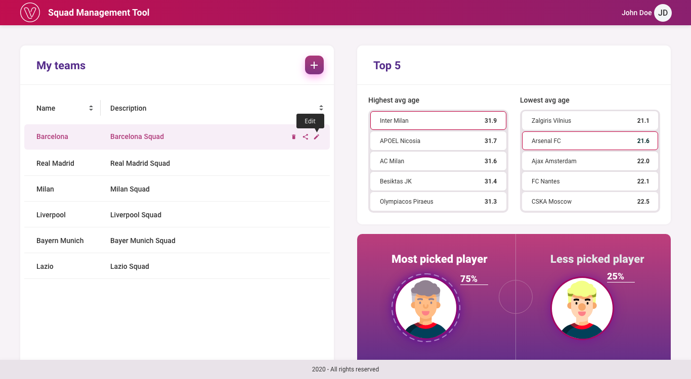
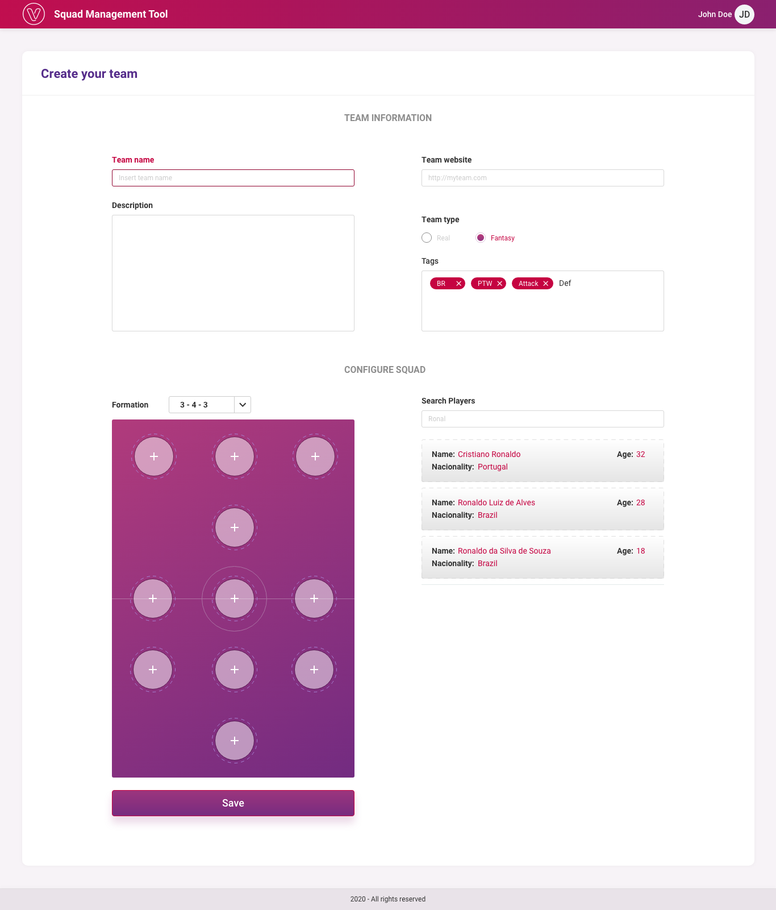

<h1 align="center">Venturus Job Test</h1>
<h2 align="center">

This project was developed as a job test for Venturus.</h1>

## The App
The app was built with React.js and illustrates an interface for creating and configuring soccer teams. It is composed of two pages, one that displays all the teams the user has created, a board displaying average ages of players and another board displaying percentages of picks for a chosen team.  

The second page is opened whenever the user wants to create a new team or configure an already existing one, displaying input fields to define the team's name, a description of the team, tags, two radio buttons to define if the team is a fictional or real one and a website URL for the team. The user can also define the formation of the team and position of each player in the field.

## Technologies used
For this app, the frontend was built with React.js, while the API was built by me with Node.js/Express.js and the information about teams and clients was stored in MongoDB Atlas, which acts as an online MongoDB database.

The backend is live at https://venturus.herokuapp.com/ and the frontend is live at https://joaoricardotg-venturus.netlify.app/.

## Implementation

The implementation is composed of an App.js file, that calls all the other components in the app. The app contains 4 mains components, MyTeams, Top5, Statistics and Configure, where the three first components are present in the main page, and the last one is present in the configuration page.

## Available Scripts

In the project directory, you can run:

### `npm start`

Runs the app in the development mode.\
Open [http://localhost:3000](http://localhost:3000) to view it in the browser.

The page will reload if you make edits.\
You will also see any lint errors in the console.

### `npm test`

Launches the test runner in the interactive watch mode.\
See the section about [running tests](https://facebook.github.io/create-react-app/docs/running-tests) for more information.

### `npm run build`

Builds the app for production to the `build` folder.\
It correctly bundles React in production mode and optimizes the build for the best performance.

The build is minified and the filenames include the hashes.\
Your app is ready to be deployed!

See the section about [deployment](https://facebook.github.io/create-react-app/docs/deployment) for more information.

### `npm run eject`

**Note: this is a one-way operation. Once you `eject`, you can’t go back!**

